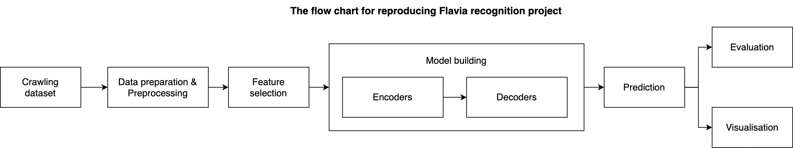
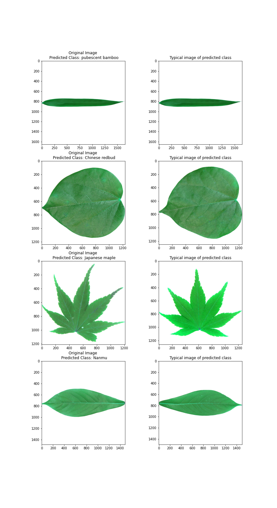

Leave Classification
==============================

The goal of this project is to automate the process of <a target="_blank" href="https://github.com/Tayerquach/Flavia_recognition">Flavia Recognition</a>.  using a leaf image as an input. The input to the system is an image of a leaf and the output is the name of the plant species to which it belongs. The project has two main stages as follows.
* [Reproduction](#reproduction)
* [Production](#production)

Project Organization
------------

    ├── LICENSE
    ├── Makefile           <- Makefile with commands like `make data` or `make train`
    ├── README.md          <- The top-level README for developers using this project.
    ├── data
    │   ├── external       <- Data from third party sources.
    │   ├── interim        <- Intermediate data that has been transformed.
    │   ├── processed      <- The final, canonical data sets for modeling.
    │   └── raw            <- The original, immutable data dump.
    │
    ├── docs               <- A default Sphinx project; see sphinx-doc.org for details
    │
    ├── models             <- Trained and serialized models, model predictions, or model summaries
    │
    ├── notebooks          <- Jupyter notebooks. Naming convention is a number (for ordering),
    │                         the creator's initials, and a short `-` delimited description, e.g.
    │                         `1.0-jqp-initial-data-exploration`.
    │
    ├── references         <- Data dictionaries, manuals, and all other explanatory materials.
    │
    ├── reports            <- Generated analysis as HTML, PDF, LaTeX, etc.
    │   └── figures        <- Generated graphics and figures to be used in reporting
    │
    ├── requirements.txt   <- The requirements file for reproducing the analysis environment, e.g.
    │                         generated with `pip freeze > requirements.txt`
    │
    ├── setup.py           <- makes project pip installable (pip install -e .) so src can be imported
    ├── src                <- Source code for use in this project.
    │   ├── __init__.py    <- Makes src a Python module
    │   │
    |   ├── helper          <- Scripts to config parameters and support fuctions
    |   |
    |   |
    │   ├── data           <- Scripts to download or generate data
    │   │  
    │   │
    │   ├── features       <- Scripts to turn raw data into features for modeling
    │   │   
    │   │
    │   ├── models         <- Scripts to train models and then use trained models to make
    │   │  
    │   │
    │   └── visualization  <- Scripts to create exploratory and results oriented visualizations
    │    
    │
    └── tox.ini            <- tox file with settings for running tox; see tox.readthedocs.io


--------

# Environment setup
1. Install Python (<a target="_blank" href="https://wiki.python.org/moin/BeginnersGuide">Setup instruction</a>)
2. Install Python packages
```console 
pip3 install -r requirements.txt 
``` 

# Reproduction


## 1. Data collection
The Flavia dataset was published in <a target="_blank" href="https://sourceforge.net/projects/flavia/files/Leaf%20Image%20Dataset/">Sourceforge</a>. Run the command line below to crawl data to folder "data/raw".
```console 
python3 src/data/pull_raw_data.py
```
## 2. Data preparation
The images from the raw data will be rotated and resized and ready for the feature selection step. Processed data are then saved in `data/processed/dataset`. Each leaf image will be labeled in `data/processed/labels`.
```console 
python3 src/data/make_dataset.py
```

**Note**: The dataset are divided into 10 folds for replicating the SOTA result. The `data/external/Dataset_10FoldCV_indexed.csv` contains "Filename", "Fold_1", "Fold_2", ..., "Fold_10" . The order of leaves were sorted by their filenames (numercial order). Values of "Fold" columns must be "Train", "Valid" or "Test".


## 3. Feature selection
Six features including vein, xyprojection, color, texture, fourier, shape are extracted and saved in "data/features".
```console 
python3 src/features/build_features.py
```

## 4. Model buiding
The architecture of convolutional neural networks are designed in `src/models/model`. In this stage, all features first are fed into the corresponding **encoder models** and then concatenated before inputing a **decoder model** to classify leaf image. Thus, we run the encoder and decoder, respectively. The performances of encoders and decoder are stored in `data/interim`. The model files are saved in `models/Dataset_10FoldCV_indexed_models`.

### 4.1. Running encoders

The encoders are running based on each corresponding feature and each fold. The setup parameters file `data/external/train_encoders_setup_parameters.csv` were saved before. 
```console 
python3 src/models/run_training_encoders.py data/external/train_encoders_setup_parameters.csv
```

After running encoders, we select the best encoders for each feature-fold pair to prepare for the decoder.
```console 
python3 src/models/select_best_encoders.py 
```

### 4.2. Running decoder

```console 
python3 src/models/run_training_decoders.py 
```
## 5. Prediction
The evaluation results are saved in `reports/figures` including confusion matrix, missclassified leave images, and kfold accuracy.
```console 
python3 src/visualization/visualize.py
```

# Production
Another project's objective is buiding an automate process of plant recognition. We keep the same data, feature collection and preprocessing step as the section [Reproduction](#reproduction). The main change here is building models.

## 1. Training model
```console 
python3 src/models/train_model_prod.py
```
The models will be saved in `models/prod_models`.

## 2. Prediction
2.1. Add leaf images needed for prediction into `data/external/testing`.

2.2. Run `Jupyter Notebook` in Browser.

2.3. Open `notebooks/predict_image` in Jupyter Notebook.

2.4. Run all the Cells one by one. In the cell #4, we need to select image file (one or multiple files).

2.5. The final results will be displayed as the example below.




## Contact 
- Boi Mai Quach (Dublin City University, mai.quach3@mail.dcu.ie) 

## References 
@article{quach2022leaf,

  title={Leaf recognition using convolutional neural networks based features},
  
  author={Quach, Boi M and Dinh, V Cuong and Pham, Nhung and Huynh, Dang and Nguyen, Binh T},
  
  journal={Multimedia Tools and Applications},
  
  pages={1--25},
  
  year={2022},
  
  publisher={Springer}
  
}
